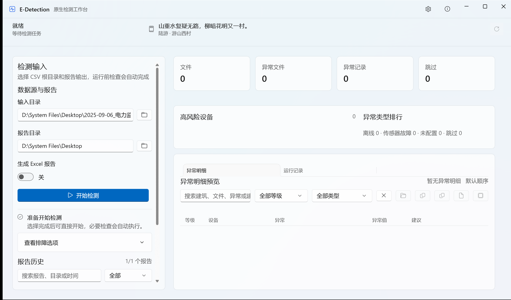

<p align="center">
  
</p>

<h1 align="center">E-Detection</h1>

<p align="center">面向电力监控与 SCADA CSV 日报的 Windows 原生异常检测工作台。</p>

<p align="center">
  <a href="https://github.com/osGex0o0II/E-Detection-OSS/releases/latest">获取最新版本</a> ·
  <a href="#快速开始">快速开始</a> ·
  <a href="#验证与发布">验证与发布</a>
</p>

> 英雄图为 E-Detection `v0.2.x` 发布物的真实视觉烟测截图；不含生成式示意图或模拟界面。

## 从 CSV 到可追溯的检测报告

E-Detection 在本机进程内完成 CSV 解析、规则检测、结果汇总和 Excel 报告生成。发布物仅使用 **C# + .NET 10 + WinUI 3**，不携带 Python 运行时、wheelhouse 或进程桥接层。

| 输入 | 检测 | 输出 |
| --- | --- | --- |
| 递归发现 CSV；识别 GBK、GB18030、UTF-8 与 UTF-8 BOM | 电压、电流、功率、功率因数、温度、冻结、离线、传感器与 CT/PT 异常 | 检测概览、异常明细、设备汇总、分类统计、传感器状态与配置的 `.xlsx` 报告 |

## 真实页面展示


工作台把输入目录、报告开关、运行前检查、风险摘要和异常明细放在同一工作流中；操作员不需要在外部脚本与多个工具之间切换。

## 核心能力

- 原生检测核心 `EDetection.NativeCore` 与 WinUI 应用壳解耦；无界面 CI 可单独验证规则和报告生成。
- 本地诊断、托盘、启动集成、任务栏进度、通知、报告历史与设置迁移均面向普通工程用户设计。
- 安装器支持按用户安装、升级、安全卸载和包完整性检查。
- 发布前执行核心、运行报告、设置、单实例、托盘、启动集成、视觉、安装和安装器烟测。

## 快速开始

需要 Windows 10/11 x64、.NET 10 SDK 与 Windows App SDK 开发环境。

```powershell
dotnet restore .\desktop\EDetection.Desktop.slnx
dotnet build .\desktop\EDetection.Desktop.slnx -c Debug
.\desktop\scripts\Test-DesktopNativeBackendSmoke.ps1 -NoBuild
```

默认阈值和规则开关位于 [`config.json`](config.json)。配置缺失、无效或出现非有限数值时，原生后端会回退至安全默认值。

## 验证与发布

```powershell
.\desktop\scripts\Publish-Desktop.ps1 -RuntimeIdentifier win-x64
.\desktop\scripts\Test-DesktopPackageHealth.ps1 -PackagePath .\artifacts\desktop\win-x64\publish
.\desktop\scripts\Build-DesktopInstaller.ps1 -RuntimeIdentifier win-x64
.\desktop\scripts\Test-DesktopInstallerSmoke.ps1 -RuntimeIdentifier win-x64
```

`v2.0.2` 发布物有意保持未签名；Windows 可能显示“未知发布者”或 SmartScreen 提示。SHA-256 仅验证文件完整性，不能验证发布者身份。真实运行数据只读审计，项目脚本不会改写输入遥测。

## 项目结构

```text
desktop/
├── EDetection.NativeCore/      # 纯 .NET 检测、规则、事件与报告
├── EDetection.Desktop/         # WinUI 3 应用壳
├── EDetection.Desktop.Tests/   # 无界面原生核心冒烟测试
├── installer/                  # Inno Setup 定义
└── scripts/                    # 发布、健康检查和桌面烟测
```
